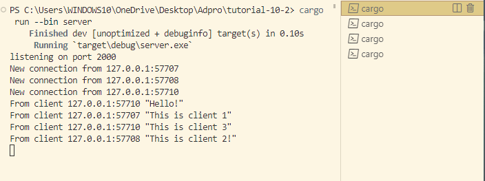
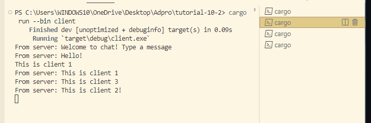
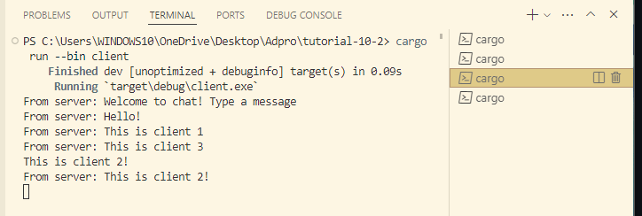
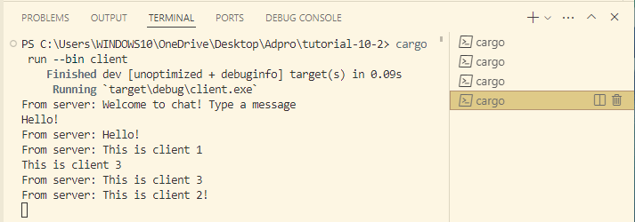

## Reflection 2.1

Since I used a loop for my code, the server then sends that message to all of the clients that are listening to the same port. 

To show this, I ran one server and three clients. From the clients, we can see that it is saying the same `From Server: <Message>` to all of the clients on the port. This means that there is no distinguishing feature between clients.

## Reflection 2.2

Simply, if we want to change the port on the client code, we also need to change the port on the server code. This is because the server-client connection listens to each other, and they need to be connected to the same port.